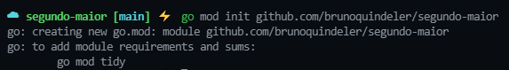
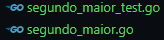
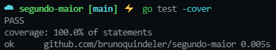
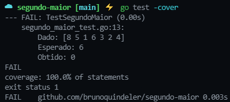

# ⚡️ Algo que aprendi com Go e TDD ⚡️
## Porque 100% de cobertura de testes funcionais nem sempre é o suficiente.

___

### Olá pessoal, vou demonstrar em um simples exemplo, passo a passo, do porquê ter **100% de cobertura de testes funcionais** nem sempre é o suficiente para garantir que sua função funciona como deveria.

___

# Sumário
1. **[Vamos lá. 🔥](#vamosla)**
2. **[Requisitos da função. 📑](#requisitos)**
3. **[Iniciando o projeto. 💻](#iniciando)**
4. **[A estrutura dos arquivos. 📂](#estrutura)**
5. **[Vamos começar pelo teste. ⚠️](#teste)**
6. **[Criando a função. 🔜](#funcao)**
7. **[Rodando o teste. 🔄](#rodandoteste)**
8. **[Ajustando o teste. ⚠️](#ajusteteste)**
9. **[Ajustando o código. ⚠️](#ajustefuncao)**
10. **[Teste funcionando. ✅✅](#testeok)**
11. **[Conclusão ☑️](#conclusao)**

___

## Vamos lá. 🔥  

Para este exemplo vamos utilizar a linguagem **[Go](https://golang.org)** e a técnica de desenvolvimento **[TDD](https://pt.wikipedia.org/wiki/Test-driven_development)** que é o desenvolvimento dirigido por testes.

___

### 🔧 Pré-requisitos se quiser seguir **Hands-On** o passo a passo.  🔨
- ✅ Go 1.13 ou maior para utilizar os módulos. Irei utilizar a versão 1.16.
**[Download](https://golang.org/doc/install)**

- ✅ Um editor de código. Irei utilizar o VSCode.
**[Download](https://code.visualstudio.com/)**

___

## Requisitos da função. 📑 
Nosso requisito é obter o segundo maior número em uma coleção de números inteiros.

___

**Exemplo:**

**Dado:** uma coleção de números inteiros. 
~~~go
[]int{2, 5, 1, 6, 3, 8, 4}
~~~

**Espero:** Obter o segundo maior número desta coleção.
~~~go
Resultado: 6
~~~

___

## Iniciando o projeto. 💻 
Criei um repositório no **[GitHub](https://github.com/)** para versionar meu código remotamente. __(Opcional).__

No terminal vamos criar um diretório, entrar nele e vamos executar o comando **(go mod init O NOME DO SEU MÓDULO)**.

É comum em Go (Não obrigatório) o nome do módulo sempre referenciar o seu repositório remoto. 
~~~bash
mkdir segundo-maior
~~~

~~~bash
cd segundo-maior
~~~

~~~bash
go mod init github.com/brunoquindeler/segundo-maior
~~~
Você deve obter uma saída parecida com esta.

___

## A estrutura dos arquivos. 📂 
Em Go, temos um pacote de testes na biblioteca padrão da linguagem.

Para que a ferramenta **go test** reconheça arquivos de teste, devemos cria-los com a seguinte sintaxe: **nome_do_arquivo_test.go**

Não é obrigatório, mas por convenção, colocaremos o mesmo nome do arquivo onde estará a nossa função.

___

## Vamos começar pelo teste. ⚠️ 

Primeiro, definimos o pacote onde estamos, no caso **main**, e importamos o pacote de testes do Go.
~~~go
package main

import "testing"
~~~

### Agora criaremos a função de teste.

O nome da função de teste sempre se inicia por Test... e é passado como parâmetro um ponteiro para a estrutura de teste da biblioteca.
~~~go
func TestNomeDoTeste(t *testing.T){
    // corpo do teste
}
~~~

Vamos definir o corpo do teste de acordo com o nosso requisito descrito anteriormente.
~~~go
func TestSegundoMaior(t *testing.T){
    dado := []int{2, 5, 1, 6, 3, 8, 4}

	esperado := 6
	obtido := SegundoMaior(dado)

	if esperado != obtido {
		t.Errorf("\nDado: %v \nEsperado: %d \nObtido: %d", dado, esperado, obtido)
	}
}
~~~
O que fizemos aqui foi definir um slice de inteiros para ser testado, também definimos o resultado esperado e passamos o retorno da função, que ainda será criada, para retornar o segundo número maior desse slice para uma variável, e ao final comparamos se o resultado é o mesmo que o esperado.

**Código final do teste:**
~~~go
package main

import "testing"

func TestSegundoMaior(t *testing.T) {
	dado := []int{2, 5, 1, 6, 3, 8, 4}

	esperado := 6
	obtido := SegundoMaior(dado)

	if esperado != obtido {
		t.Errorf("\nDado: %v \nEsperado: %d \nObtido: %d", dado, esperado, obtido)
	}
}
~~~

___

## Criando a função. 🔜 
Agora que seguimos o **TDD** e já temos o nosso teste feito, vamos criar a nossa função. 

~~~go
package main

func SegundoMaior(numeros []int) int {
	primeiro := 0
	segundo := 0

	for _, numero := range numeros {
		if numero > primeiro {
			segundo = primeiro
			primeiro = numero
		}
	}

	return segundo
}
~~~

Defininos a função que chamamos no teste anteriormente, conforme o requisito, ela recebe um slice de inteiros e retorna um inteiro.

A função **for range** em **Go** é o mesmo que **for each**.

Em **Go** uma função pode ter vários retornos, no caso do **for range** ele retorna o índice e o elemento, e quando usamos o Blank Identifier (underscore) simplesmente queremos dizer "este valor não me interessa" 😂😂 não precisaremos do índice.

___

### Bom, esta função parece satisfazer o nosso requisito, vamos testar?

___

## Rodando o teste. 🔄 
Para rodar testes em **Go** é bem simples e faremos isso direto no terminal, sem precisar baixar nenhuma ferramenta ou pacote externo.

o comando para rodar os testes é **go test**, mas utilizaremos a flag **-cover** para retornar também a cobertura do nosso teste.

~~~bash
go test -cover
~~~
Saída esperada do comando.

 💯💯💯

Repare que o nosso teste passou e tem uma cobertura de 100% da função. 

Legal, era o que queriamos 😄😄

Mas temos um porém, nós apenas "dizemos" que rodamos o nosso teste em um cenário e ele passou e por isso obteve 100% de cobertura.

Mas... e se criássemos outros cenários de teste que podemos imaginar ser possível ❓❕❓

E se o segundo número maior viesse depois do primeiro ❓❕❓

**Exemplo: vamos colocar o maior em primeiro lugar, será que nossa função atende a este cenário?**
~~~go
package main

import "testing"

func TestSegundoMaior(t *testing.T) {

	dado := []int{8, 5, 1, 6, 3, 2, 4}

	esperado := 6
	obtido := SegundoMaior(dado)

	if esperado != obtido {
		t.Errorf("\nDado: %v \nEsperado: %d \nObtido: %d", dado, esperado, obtido)
	}
}
~~~
Rodando o teste novamente.

 ❌❌❌

Repare que a nossa cobertura continua em 100%, porém, o nosso teste falhou.

Este é o problema, devemos imaginar todos os cenários possíveis para poder garantir que a função irá funcionar corretamente, com a miníma possibilidade de falhas, mesmo com 100% de cobertura da função.

___

## Ajustando o teste. ⚠️ 
### Vamos precisar criar diversos cenários para os testes, então vamos criar uma estrutura auxiliadora para facilitar a criação deles.

___

~~~go
    cenarios := []struct {
            descricao string
            dado      []int
            esperado  int
        }{
            {
                descricao: "Teste 1",
                dado:      []int{2, 5, 1, 6, 3, 8, 4},
                esperado:  6,
            },
            {
                descricao: "Teste 2",
                dado:      []int{8, 1, 6, 3, 2, 4},
                esperado:  6,
            },
        }
~~~
O que fizemos foi atribuir a variável **"cenarios"** um slice de structs (structs é uma forma de você definir estruturas de dados personalizadas, assim facilita no entendimento do código, entre outras coisas).

Criamos apenas dois cenários, mas podemos criar quantos quiser.

**Obs: "descricao"** deve ser uma descrição minima do cenário, coloquei de forma mais genérica porque é apenas um exemplo.

___

Agora criaremos um **for** para percorrer este slice de estruturas e rodar um teste para cada cenário.

~~~go
    for _, cenario := range cenarios {
            obtido := SegundoMaior(cenario.dado)

            retornaResultado(t, cenario.dado, cenario.esperado, obtido)
        }
~~~
Como visto dentro do **for** temos uma função nova "retornaResultado".

Criei ela separada apenas para facilitar na leitura e modificações.

**Ela ficou desta forma:**

~~~go
func retornaResultado(t *testing.T, dado []int, esperado, obtido int) {
	t.Helper()

	if esperado != obtido {
		t.Errorf("\nDado: %v \nEsperado: %d \nObtido: %d", dado, esperado, obtido)
	}
}
~~~

**E assim ficou o código final do teste:**
~~~go
package main

import "testing"

func TestSegundoMaior(t *testing.T) {

	cenarios := []struct {
		descricao string
		dado      []int
		esperado  int
	}{
		{
			descricao: "Teste 1",
			dado:      []int{2, 5, 1, 6, 3, 8, 4},
			esperado:  6,
		},
		{
			descricao: "Teste 2",
			dado:      []int{8, 1, 6, 3, 2, 4},
			esperado:  6,
		},
	}

	for _, cenario := range cenarios {
		obtido := SegundoMaior(cenario.dado)

		retornaResultado(t, cenario.dado, cenario.esperado, obtido)
	}
}

func retornaResultado(t *testing.T, dado []int, esperado, obtido int) {
	t.Helper()

	if esperado != obtido {
		t.Errorf("\nDado: %v \nEsperado: %d \nObtido: %d", dado, esperado, obtido)
	}
}
~~~

___

## Ajustando o código. ⚠️ 
### Agora precisamos ajustar o código para atender os novos cenários.

___

Na nossa função eu apenas adicionei um novo **if** para checar se o número atual é menor que o primeiro e maior que o segundo e sendo verdadeira esta condição eu atribuo o número ao segundo.
~~~go
package main

func SegundoMaior(numeros []int) int {
	primeiro := 0
	segundo := 0

	for _, numero := range numeros {
		if numero > primeiro {
			segundo = primeiro
			primeiro = numero
		}
		if numero < primeiro && numero > segundo {
			segundo = numero
		}
	}

	return segundo
}
~~~

**OBS:** Pode existir outras formas de criar este algoritmo.

___

## Teste funcionando. ✅✅ 
Por fim, vemos nosso teste passando novamente e com mais confiança de que está certo.

 💯💯💯

___

## Conclusão ☑️ 
É isso pessoal, mesmo que o exemplo seja bem simples, eu espero que tenha passado uma noção da importância de diversos cenários para seu teste, e também uma breve noção de **Go** para quem não conhece a linguagem. 😄😄